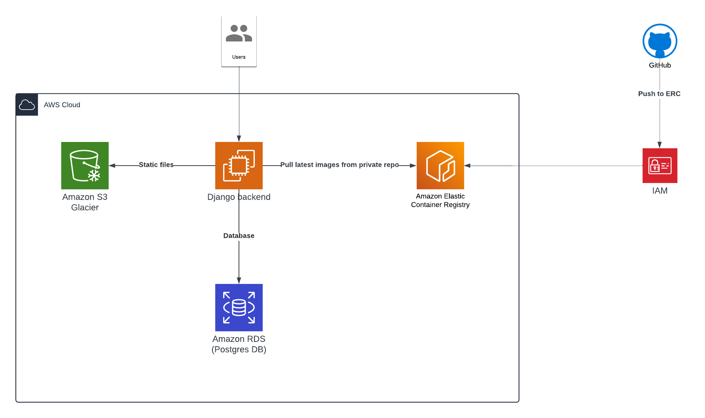

# Credit Guard

Credit Guard is a project designed to implement algorithm to hash CC information to demonstrate the knowledge of DRF, Django and other packages to complete the project for a Junior Python Developer position. This document provides a comprehensive guide on how to download, set up, and run the Credit Guard project.

## Prerequisites

**NOTE**: If you're on windows, it might have issues starting as
it is written on UNIX-like system and works perfectly on any Linux distro
or MacOS

Before you begin, ensure you have the following installed on your machine:

- Python (version 3.10 or higher)
- Git
- Docker
- Docker-Compose

## Installation

### Step 1: Clone the Repository

Open a terminal or command prompt and run the following command to clone the repository:

```bash
git clone https://github.com/fantozy/credit-guard.git
```

### Step 2: Navigate to the Project Directory

Change your directory to the cloned repository:

```bash
cd credit-guard
```

### Step 3: Build images and run containers

```bash
docker-compose up --build
```

or if your system has bash installed on it, simply run

```bash
. build
```

## Configuration

### Step 4: Configure the Project

Check for any environment configuration files like `.env` to let you know about password and stuff.


### Step 5: Run migrations

Enter docker container:

```bash
docker exec -it credit-guard-web bash
python3 credit_guard/manage.py migrate
```

### Step 6: Create a Superuser (Required)


```bash
# Still in container
python3 credit_guard/manage.py createsuperuser
```

## Running the Project

### Step 7: Run the Development Server

Run the development server:

```bash
python manage.py runserver
```

### Step 8: Access the Project

Open your web browser and go to `http://127.0.0.1:8000` to see the project running.

### Step 9: Running tests

```bash
docker exec -it credit-guard-web bash
python3 credit_guard/manage.py test
```

## Troubleshooting

- **Port already in use:** Ensure that no project in running on port **8000** otherwise change it from **docker-compose.yaml** to something else that is not in use

## Acknowledgments

- This project is for Junior Python Developer position so it has no real usage


## Important

To showcase the knowledge which I possess, I've deployed the given project on AWS using services such as:

- IAM - for managing users, their roles and permissions
- EC2 - for pulling the images and running containers from them
- S3 - for static file storage such as admin files and drf files
- RDS - for DBMS, specifically Postgres
- ERC - for hosting private container image repository

You can visit [production docs on aws](http://3.75.134.44:8000/swagger/) to test out the API or view the endpoints where you can use DRF browsable API.

To authenticate, the user is:

- login: admin
- password: admin



